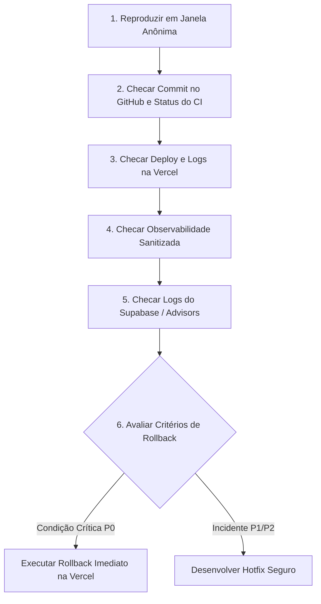

# 🚨 Guia de Resposta a Incidentes & Matriz de Severidade — BARBEOS

Este documento define o processo operacional para identificação, registro, contenção e resolução de incidentes no **BARBEOS**, garantindo a segurança dos dados, a continuidade do negócio e a privacidade dos usuários.

---

## 🚦 Modelo de Severidade de Incidentes

| Nível | Classificação | Tempo de Resposta Inicial | Exemplos Típicos |
|---|---|---|---|
| **P0** | **Ação Imediata (Crítico)** | < 15 minutos | • Site principal indisponível (5xx generalizado).<br>• Login de clientes ou administradores quebrado.<br>• Agendamento público indisponível ou falhando na confirmação.<br>• Falha de atomicidade com agendamento duplicado/conflito.<br>• Vazamento de dados entre barbearias (cross-tenant) ou exposição de PII.<br>• Inconsistência financeira, corrupção de saldo de carteira, pontos de fidelidade ou caixa.<br>• `ErrorBoundary` global travando rota crítica. |
| **P1** | **Alta Prioridade** | < 1 hora | • Módulo administrativo específico inacessível (ex.: `/admin/servicos` ou `/admin/profissionais`).<br>• Grade de horários ou disponibilidade não carrega.<br>• Erro ao renderizar a tela do PDV.<br>• Rotas públicas secundárias (`/barbearias`, `/servicos`) falhando.<br>• Aumento persistente de erros 4xx/5xx em chamadas Supabase. |
| **P2** | **Prioridade Normal** | Próximo ciclo / dia útil | • Desalinhamento visual ou quebra leve de layout.<br>• Defeito de acessibilidade que não impede a conclusão do fluxo.<br>• Erro ortográfico ou texto informativo desatualizado.<br>• Regressão menor de tempo de carregamento que não causa time-out. |

---

## 📋 Diretrizes de Registro (O que registrar vs O que NUNCA registrar)

A proteção à privacidade é estrita. Ao documentar um incidente:

### ✅ O que REGISTRAR (Dados Seguros):
- **Data e Hora exatas** (com fuso horário, ex.: `2026-09-08 11:30 BRT`).
- **Rota ou URL afetada** (ex.: `/agendar?barbershop=demo` ou `/admin/pdv`).
- **Hash do commit da release** em produção (ex.: `4ba8cb3`).
- **Perfil do usuário** envolvido (ex.: `visitante anônimo`, `cliente logado`, `proprietário admin`) — **sem** identificar a pessoa.
- **Código de erro sanitizado** (ex.: `BOOKING_SLOT_TAKEN`, `42501`, `PGRST116`, `500 Internal Server Error`).
- **Comportamento esperado vs Comportamento observado**.
- **Impacto estimado** (ex.: número de barbearias ou agendamentos impactados).

### 🚫 O que NUNCA REGISTRAR (Dados Proibidos / Violações de Segurança):
- **Senhas de usuários** em texto plano ou criptografadas.
- **Tokens de autenticação** (JWT, `sb-...-auth-token`, Bearer tokens).
- **Cookies de sessão** ou cabeçalhos de autorização completos.
- **Dados Pessoais Identificáveis (PII):** Nomes completos de clientes, números de telefone celular, CPFs, e-mails.
- **Registros brutos de clientes** ou prints contendo listas com dados de terceiros.
- **Corpos brutos (raw bodies) de respostas da base de dados** ou strings de conexão com credenciais.

---

## 🛠️ Fluxo de Primeiro Atendimento (First-Response Flow)

Ao ser notificado de uma anomalia em produção, siga este fluxo sequencial:



### Detalhamento das Etapas:
1. **Reproduzir em Janela Anônima:**
   Abra uma janela anônima e execute a mesma ação relatada para verificar se o erro persiste sem cache local.
2. **Checar Commit no GitHub e Status do CI:**
   Verifique qual foi o último commit mesclado em `main` e se o workflow de CI passou integralmente.
3. **Checar Deploy e Logs na Vercel:**
   No painel da Vercel, inspecione a aba **Deployments** e veja se o status está `Ready` ou se há falhas registradas nos **Runtime Logs**.
4. **Checar Observabilidade Sanitizada do BARBEOS:**
   Consulte os logs estruturados emitidos pela camada de observabilidade (`src/lib/observability.ts`). Filtre por fonte:
   - `booking`: conflitos de concorrência ou reservas;
   - `network`: falhas de RPC ou REST no Supabase;
   - `ui` / `router`: falhas de renderização de componentes React ou rotas TanStack Router.
5. **Checar Logs do Supabase / Advisors:**
   No dashboard do Supabase, verifique os logs do PostgreSQL e os relatórios do Database Advisor para identificar eventuais violações de RLS (`42501`) ou índices ausentes.
6. **Avaliar Critérios de Rollback:**
   Se a falha enquadra-se nos critérios críticos P0 definidos na seção E do [RELEASE_RUNBOOK.md](./RELEASE_RUNBOOK.md), acione o **Instant Rollback** na Vercel imediatamente.

---

## 📢 Template de Comunicação Interna (Notas de Incidente)

Utilize este modelo padronizado para documentar internamente o incidente:

```markdown
### 📝 Registro de Incidente — BARBEOS

- **Identificador:** INC-[ANO]-[NUMERO] (Ex: INC-2026-001)
- **Classificação de Severidade:** [P0 / P1 / P2]
- **Status:** [Investigando / Mitigado / Resolvido]
- **Data/Hora de Início:** AAAA-MM-DD HH:MM (Fuso horário)
- **Commit da Release:** [Hash Git curto]
- **Rota / Módulo Afetado:** [ex: /agendar ou /admin/pdv]
- **Perfil Afetado:** [ex: Clientes públicos / Administradores]
- **Código de Diagnóstico Seguro:** [ex: 500 / BOOKING_SLOT_TAKEN / 42501]

#### 1. Descrição do Problema
[Descrever resumidamente o que aconteceu, esperado vs observado, sem incluir PII]

#### 2. Causa Raiz Identificada
[Explicação técnica do motivo da falha]

#### 3. Ação Imediata Tomada (Contenção)
[Ex: Rollback efetuado para o deployment estável anterior na Vercel OU hotfix aplicado]

#### 4. Ações Preventivas (Follow-up)
- [ ] Adicionar teste automatizado de regressão no Playwright/Vitest.
- [ ] Atualizar documentação/runbook se aplicável.
```

---

## ✅ Checklist de Verificação de Resolução

Antes de declarar o incidente como **Resolvido**, certifique-se de preencher todos os itens:

- [ ] A causa raiz foi identificada e contida (via rollback ou deploy de hotfix aprovado).
- [ ] O smoke test não-destrutivo ([PRODUCTION_SMOKE_TEST.md](./PRODUCTION_SMOKE_TEST.md)) foi executado com aprovação em 100% das rotas críticas.
- [ ] Nenhum erro 5xx contínuo ou exceção não tratada está sendo emitida nos logs de observabilidade.
- [ ] Os dados da base de dados foram auditados (sem perda de integridade, sem agendamentos duplicados).
- [ ] Se houve rollback no painel da Vercel, o repositório Git foi sincronizado via `git revert` na branch `main`.
- [ ] O teste automatizado correspondente ao bug foi adicionado à suíte de testes E2E/Unitários para prevenir qualquer regressão futura.
- [ ] As notas do incidente foram preenchidas e arquivadas.
