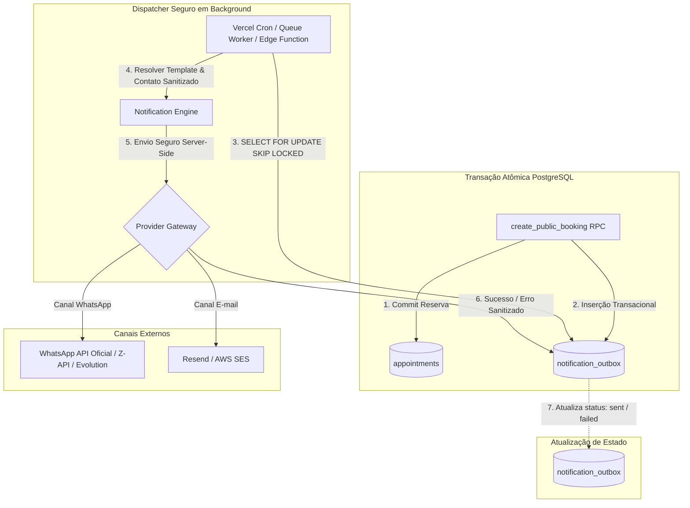

# 📬 Arquitetura e Design de Notificações de Agendamentos — BARBEOS

Este documento estabelece o design técnico, a especificação de eventos, a estratégia de idempotência e a governança de privacidade para o ciclo de vida de agendamentos e notificações no **BARBEOS**.

> [!IMPORTANT]
> **Documento de Design e Descoberta Técnica (Etapa 15)**  
> Nenhuma integração com provedores de envio foi implementada nesta etapa, nenhuma alteração de schema/RLS foi aplicada e nenhuma mensagem real é disparada. Este documento serve como especificação oficial para as fases de implementação futuras.

---

## 1. Inventário do Ciclo de Vida Atual de Agendamentos

O BARBEOS opera com a tabela `public.appointments` associada ao enum `public.appointment_status`:
`scheduled`, `in_progress`, `completed`, `cancelled`, `no_show`.

### Matriz de Transições de Estado

| Transição | Rota / Serviço de Origem | Papel / Permissão | Tabela / Função | Atomicidade | Evento Emitido | Idempotente? | Impacto Financeiro / Fidelidade | Auditoria / Histórico | Notificação Adequada |
|---|---|---|---|---|---|---|---|---|---|
| **→ `scheduled`** (Criação) | `/agendar` (`appointmentService.createPublicBooking`) | Visitante anônimo ou Cliente logado | RPC `public.create_public_booking` | **Sim** (advisory lock por profissional + `exclusion_violation`) | Nenhum | **Não** (re-execução rejeitada com `BOOKING_SLOT_TAKEN`) | Nenhum no agendamento inicial | Apenas `created_at`, `created_by` | **Sim**: Confirmação Imediata (`appointment.created` / `confirmed`) |
| **→ `scheduled`** (Manual Admin) | `/admin/agenda` (`appointmentService.createAppointment`) | Proprietário, Barbeiro, Recepcionista | Multi-insert em `appointments` e `appointment_services` | **Parcial** (pré-checagem no client, sem advisory lock) | Nenhum | **Não** (pode colidir em concorrência alta) | Nenhum | Apenas `created_at`, `created_by` | **Sim**: Confirmação / Criação pelo estabelecimento |
| **`scheduled` → `in_progress`** | `/admin/agenda` (Botão "Confirmar / Em atendimento") | Proprietário, Barbeiro, Recepcionista | `appointments.update({ status: 'in_progress' })` | **Sim** (single-row update) | Nenhum | **Sim** | Nenhum | Apenas `updated_at` | **Opcional / Interno**: Notificação para fila/painel |
| **`in_progress` → `completed`** | `/admin/agenda` (`completeAndPay`) ou `/admin/pdv` | Proprietário, Recepcionista | Multi-query JS (`appointments`, `cash_transactions`, `commissions`) | **Não** (multi-tabela sem RPC unificada) | Nenhum | **Não** (re-execução duplicaria transação de caixa e comissão) | **Sim**: Registra venda no caixa e comissão do profissional | Registros em `cash_transactions` e `commissions` | **Sim**: Recibo / Agradecimento e Pesquisa NPS (`/avaliar/$id`) |
| **`scheduled` / `in_progress` → `cancelled`** (Admin) | `/admin/agenda` (`cancelMut`) | Proprietário, Recepcionista, Barbeiro | `appointments.update({ status: 'cancelled' })` | **Sim** (single-row update) | Nenhum | **Sim** | Não reverte transações financeiras passadas | Apenas `updated_at` (motivo não persistido) | **Sim**: Aviso de Cancelamento pela barbearia |
| **`scheduled` → `cancelled`** (Cliente) | `/minha-conta` (`cancelMut`) | Cliente autenticado (dono do agendamento) | `appointments.update({ status: 'cancelled' })` | **Sim** (single-row update com RLS) | Nenhum | **Sim** | Nenhum | Apenas `updated_at` | **Sim**: Confirmação de Cancelamento ao cliente e alerta ao barbeiro |
| **`scheduled` → `no_show`** | `/admin/agenda` (`AgendaCard.tsx`) | Proprietário, Recepcionista | `appointments.update({ status: 'no_show' })` + `customer.service.incrementNoShow` | **Não** (duas chamadas client-side separadas) | Nenhum | **Não** (cada clique incrementa contador de faltas do cliente) | Incrementa `customers.no_show_count` | Apenas contador acumulado | **Sim**: Notificação amigável de falta com convite para reagendar |
| **Remarcação** (`scheduled` → `scheduled` com nova data) | `/admin/agenda` (`RescheduleDialog`) | Proprietário, Recepcionista | `appointments.update({ scheduled_start, scheduled_end })` | **Parcial** (pré-validação client-side, sem advisory lock) | Nenhum | **Não** (sem concorrência atômica na alteração de horário) | Nenhum | `updated_at` (data anterior é sobrescrita e perdida) | **Sim**: Confirmação de Remarcação (De [Data Antiga] Para [Nova Data]) |

---

## 2. Inventário de Dados de Contato e Consentimento

### Campos Atuais no Banco de Dados
- **`customers.full_name`:** Texto obrigatório, capturado na reserva pública ou cadastro admin. Não verificado.
- **`customers.phone`:** Texto opcional/informado. Na RPC atômica é limpo via `regexp_replace(phone, '\D', '', 'g')` (10 ou 11 dígitos no padrão brasileiro DDD+Número). Não passa por verificação OTP e não está normalizado em E.164 (`+55...`).
- **`customers.email`:** Texto opcional, sem validação de entregabilidade ou link de verificação.
- **`profiles.phone` e `profiles.full_name`:** Armazenados no perfil do usuário autenticado (`auth.users`), desconectados de consentimento para mensagens transacionais.
- **`barbershops.contacts`:** Campo `jsonb` contendo `{ phone, whatsapp, email, website }`. Usado como canal oficial de exibição da barbearia.
- **`barbershops.settings`:** Campo `jsonb` utilizado para timezone (`barbershop.settings->>'timezone'`).

### Diagnóstico de Consentimento e Preferências
- **Validação de Contato:** Todos os campos de telefone e e-mail de clientes são **UNVERIFIED**.
- **Formato Canônico Atual:** Dígitos puros (`11999999999`). Falta normalização para E.164 (`+5511999999999`).
- **Status de Modelo de Consentimento:**
  ```text
  MISSING — communication preference model
  ```
  O sistema atualmente **NÃO** possui:
  - Registro de aceite dos termos de comunicação ou LGPD;
  - Seleção de canal preferido (WhatsApp vs. E-mail vs. SMS);
  - Mecanismo de opt-out / descadastro para clientes;
  - Preferências de notificação para proprietários e equipe (ex.: receber aviso a cada agendamento recebido).
- **Isolamento de Tenants:** A tabela `customers` possui `barbershop_id` com FK e isolamento via RLS por barbearia. O mesmo número de telefone pode existir em barbearias diferentes sem vazamento de histórico.

---

## 3. Inventário de Provedores e Integrações Existentes

Varredura realizada em todo o repositório (`package.json`, `src/integrations/`, `src/services/`, `supabase/`, `.env.example`):

| Provedor / Tecnologia | Localização | Status no Projeto | Descrição / Diagnóstico |
|---|---|---|---|
| **Resend** | N/A | **NOT PRESENT** | Nenhum pacote ou chave configurada na aplicação principal. |
| **SendGrid / Twilio** | N/A | **NOT PRESENT** | Inexistente. |
| **Z-API / Evolution API** | N/A | **NOT PRESENT** | Inexistente. |
| **WhatsApp (@whiskeysockets/baileys)** | `whatsapp-bot/` | **CONFIGURED BUT UNUSED (DEAD CODE no app web)** | Protótipo isolado em Node.js com Baileys (QR Code terminal) e monitoramento de `INSERT` no Supabase via Realtime. Não possui idempotência, roda fora do deploy da Vercel, assume conexão mono-tenant e não está conectado à aplicação web principal. |
| **Supabase Edge Functions** | `supabase/functions/` | **NOT PRESENT** | Diretório inexistente no repositório. |
| **Provedores de E-mail / SMS** | N/A | **NOT PRESENT** | Nenhuma chamada de envio de e-mail ou SMS presente na base de código. |

---

## 4. Arquitetura de Entrega Recomendada (Transactional Outbox)

### Análise Comparativa das Opções

- **Opção A (Supabase Outbox via Banco de Dados):**
  - *Prós:* Acoplamento transacional estrito — o evento só existe se a transação do agendamento comitar com sucesso. Zero risco de notificações fantasmas. Retry nativo no banco.
  - *Contras:* Requer tabela de outbox e worker/função consumidora.
- **Opção B (Vercel Serverless / Job Delivery):**
  - *Prós:* Código em TypeScript compartilhado, fácil integração com SDKs de provedores.
  - *Contras:* Funções serverless têm timeout de execução e dependem de cron jobs ou queues para retry confiável.
- **Opção C (Webhook Externo / n8n / Zapier):**
  - *Prós:* Menor volume de código na aplicação.
  - *Contras:* Perda de controle sobre privacidade, custo adicional, dificuldade de governança e de teste de idempotência.
- **Opção D (E-mail Primeiro, WhatsApp Depois):**
  - *Prós:* Menor barreira de entrada, custos previsíveis, conformidade simplificada.
  - *Contras:* No segmento de barbearias no Brasil, o WhatsApp possui taxa de abertura e conversão 8x superior ao e-mail.

### Arquitetura Recomendada: **Padrão Outbox Híbrido (Opção A + B com Abstração de Provedores)**



#### Recomendações por Tipo de Mensagem:
1. **Confirmação:** Envio automático imediato via Outbox disparado após a conclusão atômica da reserva.
2. **Lembrete (24h / 2h):** Enfileiramento programado no Outbox com `scheduled_for` definido. O despachante processa lotes cuja data/hora foi atingida.
3. **Cancelamento:** Envio imediato disparado pelo trigger ou serviço no momento em que `status` muda para `cancelled`.
4. **Remarcação:** Envio imediato informando os dados antigos e novos horários, com cancelamento simultâneo dos lembretes agendados para a data antiga.

---

## 5. Catálogo de Eventos e Estratégia de Idempotência

### Chave de Idempotência Canônica
Para prevenir envios duplicados em qualquer cenário de re-execução, falha de rede ou timeout do provedor, a chave canônica deve seguir estritamente o formato:

```text
idempotency_key = <appointment_id> + ":" + <event_type> + ":" + <channel> + ":" + <delivery_bucket>
```

> [!CAUTION]
> **Regras Estritas de Idempotência:**
> - Jamais utilizar telefone ou e-mail do cliente na chave de idempotência;
> - Jamais armazenar corpo bruto da mensagem nos logs de auditoria;
> - A chave deve ser única no banco de dados (`UNIQUE CONSTRAINT` na tabela de outbox).

### Especificação dos Eventos do Catálogo

| Evento | Origem | Payload Seguro (Sem PII Desnecessária) | Destinatário | Canais Permitidos | `delivery_bucket` | Política de Retry | Requisito de Commit |
|---|---|---|---|---|---|---|---|
| `appointment.created` | RPC `create_public_booking` | `appointment_id`, `barbershop_id`, `professional_id`, `start_time`, `end_time` | Cliente | WhatsApp, E-mail | `creation` | 3 tentativas (1m, 5m, 15m) | **Obrigatório** (pós-commit) |
| `appointment.confirmed` | `/admin/agenda` | `appointment_id`, `barbershop_id`, `start_time` | Cliente | WhatsApp, E-mail | `confirmation` | 3 tentativas (1m, 5m, 15m) | **Obrigatório** |
| `appointment.reminder_24h` | Cron Scheduler | `appointment_id`, `barbershop_id`, `start_time` | Cliente | WhatsApp, E-mail | `24h` | 2 tentativas (5m, 15m) | **Obrigatório** |
| `appointment.reminder_2h` | Cron Scheduler | `appointment_id`, `barbershop_id`, `start_time` | Cliente | WhatsApp, E-mail | `2h` | 2 tentativas (2m, 5m) | **Obrigatório** |
| `appointment.rescheduled` | `/admin/agenda` (`RescheduleDialog`) | `appointment_id`, `barbershop_id`, `old_start_time`, `new_start_time` | Cliente, Barbeiro | WhatsApp, E-mail | `reschedule_<timestamp>` | 3 tentativas (1m, 5m, 15m) | **Obrigatório** |
| `appointment.cancelled` | `/admin/agenda` ou `/minha-conta` | `appointment_id`, `barbershop_id`, `cancelled_by_role`, `start_time` | Cliente, Barbeiro | WhatsApp, E-mail | `cancellation` | 3 tentativas (1m, 5m, 15m) | **Obrigatório** |
| `appointment.no_show` | `/admin/agenda` (`AgendaCard`) | `appointment_id`, `barbershop_id`, `customer_id` | Cliente | WhatsApp | `noshow` | 2 tentativas (15m, 60m) | **Obrigatório** |
| `appointment.completed` | `/admin/agenda` (`completeAndPay`) | `appointment_id`, `barbershop_id`, `review_link` | Cliente | WhatsApp, E-mail | `survey` | 2 tentativas (30m, 2h) | **Obrigatório** |

---

## 6. Política de Retentativas e Dead-Letter (DLQ)

1. **Backoff Exponencial com Jitter:**
   - Tentativa 1: Imediato / 1 minuto.
   - Tentativa 2: 5 minutos + jitter aleatório (0 a 30s).
   - Tentativa 3: 15 minutos + jitter aleatório.
2. **Tratamento de Erros:**
   - **Erros Transitórios** (HTTP 429, 500, 502, 503, 504, timeout de rede): Elegíveis para retry conforme a política acima.
   - **Erros Fatais** (HTTP 400 número inválido, 403 não autorizado, destinatário bloqueado/opt-out): Transição imediata para `failed` / `dead_letter` sem novas tentativas.
3. **Expiração Automática:**
   - Se o horário do agendamento (`scheduled_start`) já tiver passado enquanto uma notificação de confirmação ou lembrete ainda estiver pendente ou em retry, o registro é automaticamente marcado como `expired` para evitar o envio de mensagens extemporâneas que causem confusão ao cliente.
4. **Isolamento de Falhas (Non-blocking Guarantee):**
   - Sob nenhuma circunstância a indisponibilidade ou lentidão do provedor de notificação poderá bloquear, atrasar ou reverter a criação atômica do agendamento no banco de dados.

---

## 7. Temporização e Regras de Lembretes (Reminder Timing)

### Fuso Horário Autoritativo
O cálculo de antecedência e horário de envio deve obrigatoriamente utilizar o fuso horário configurado na barbearia:
```text
v_tz := COALESCE(barbershop.settings->>'timezone', 'America/Sao_Paulo');
```
*Se `barbershop.settings->>'timezone'` não estiver preenchido, assume-se `America/Sao_Paulo` como fallback padrão do território brasileiro.*

### Regras de Janela de Agendamento
1. **Agendamento com antecedência superior a 24 horas:**
   - Recebe lembrete de 24h e lembrete de 2h.
2. **Agendamento criado dentro da janela de 24 horas (ex.: agendado com 8h de antecedência):**
   - O lembrete de 24h é ignorado (`skipped_due_to_window`).
   - O lembrete de 2h permanece ativo.
3. **Agendamento criado dentro da janela de 2 horas (ex.: para daqui a 45 minutos):**
   - Ambos os lembretes são ignorados. O cliente recebe apenas a confirmação imediata.

### Regra de Horário Silencioso (Quiet Hours)
- **Janela de Silêncio:** Nenhuma mensagem automática pode ser disparada entre **22:00** e **08:00** no horário local da barbearia.
- **Tratamento:** Caso o lembrete de 24h recaia durante o horário silencioso, o envio é antecipado para as **20:00** do dia anterior ou postergado para as **08:00** da manhã do mesmo dia.

---

## 8. Design da Experiência do Cliente (Customer UX)

Todas as comunicações com clientes devem ser formuladas em português brasileiro claro, cordial e sem jargões técnicos.

### Estados de Tela e Mensagens ao Cliente

1. **Tela de Confirmação (`/agendar`):**
   - Exibição de cabeçalho: *"Agendamento Confirmado!"*
   - Card com resumo: Nome da barbearia, profissional, serviços selecionados, data, horário e valor.
   - Mensagem de notificação informativa:
     - Se o cliente informou WhatsApp: *"Enviaremos os detalhes e lembretes para o WhatsApp (XX) XXXXX-XXXX."*
     - Se o canal estiver instável: *"Seu horário já está 100% reservado no sistema da barbearia."* (Sem mensagens alarmistas de erro técnico).
2. **Painel do Cliente (`/minha-conta`):**
   - Exibição dos agendamentos futuros com badges: `Confirmado`, `Em andamento`, `Finalizado`, `Cancelado`.
   - Botão de autoatendimento para *Cancelar Agendamento*.
3. **Fluxo de Remarcação:**
   - Notificação clara destacando: *"Seu horário foi alterado de [Data/Hora Anterior] para [Nova Data/Hora]."*
4. **Clientes Anônimos vs. Autenticados:**
   - Clientes que agendam de forma anônima recebem um token de consulta seguro (hash UUID) para consultar seu agendamento na web sem expor telefones de outros clientes.

---

## 9. Design da Experiência Administrativa (Admin UX)

Na área administrativa (`/admin/configuracoes` e `/admin/agenda`):

1. **Painel de Configuração de Notificações (`/admin/configuracoes`):**
   - Toggle geral de ativação do canal (WhatsApp Ativo / Inativo, E-mail Ativo / Inativo);
   - Seleção das janelas de lembrete desejadas (24h antes, 2h antes);
   - Definição do horário de silêncio (ex.: 22h às 08h);
   - Campo para mensagem personalizada de rodapé ou instruções de chegada.
2. **Visibilidade Operacional na Agenda (`/admin/agenda`):**
   - No Drawer de detalhes do agendamento, inclusão de uma seção compacta de auditoria de mensagens:
     - Ícone de status: `Pendente` ⏳, `Enviado` ✅, `Falhou` ⚠️, `Cancelado` 🚫.
     - Horário do último envio e identificador do canal.
3. **Controle Manual Seguro:**
   - Botão *"Reenviar Confirmação"*: Gera uma nova tentativa com verificação estrita de permissão e idempotência para evitar envios duplicados.
   - Opção de desmarcar notificações automáticas para clientes que solicitaram não receber mensagens.
4. **Privacidade Administrativa:**
   - Logs de envio acessíveis ao administrador exibem apenas o status, data/hora e tipo de erro sanitizado (ex.: `TIMEOUT`, `NUMERO_INVALIDO`), nunca dados de cartão, senhas ou tokens.

---

## 10. Segurança, Privacidade e LGPD

1. **Armazenamento de Segredos:**
   - Chaves de API de provedores (ex.: `RESEND_API_KEY`, `WHATSAPP_TOKEN`, `GATEWAY_SECRET`) devem residir exclusivamente em variáveis de ambiente de produção no servidor (Vercel Environment Variables).
   - Proibição estrita de prefixos `VITE_` para qualquer credencial de mensageria.
2. **Minimização de PII:**
   - A tabela de Outbox armazena apenas identificadores relacionais (`appointment_id`, `barbershop_id`, `customer_id`). Os dados de contato (telefone/e-mail) são resolvidos dinamicamente no momento do disparo.
3. **Validação de Assinatura em Webhooks de Retorno:**
   - Webhooks de status recebidos de provedores (ex.: confirmação de entrega `DELIVERED` ou leitura `READ`) devem ser autenticados via assinatura HMAC SHA-256 no header da requisição.
4. **Gestão de Opt-out (Descadastro):**
   - Mensagens de WhatsApp devem processar comandos automáticos de cancelamento de notificações (ex.: *"Para não receber mais lembretes, responda PARAR"*).
   - E-mails devem conter cabeçalho padrão `List-Unsubscribe` e link de descadastro direto com token temporário assinado.
5. **Rate Limiting:**
   - Limite rígido de no máximo 4 notificações por agendamento (confirmação + 2 lembretes + pesquisa pós-atendimento) para evitar abusos ou penalizações por spam no WhatsApp.

---

## 11. Plano de Migração e Alterações de Schema Futuras

*(A ser implementado em tarefas posteriores — NÃO aplicado nesta etapa)*

### 1. Nova Tabela de Outbox: `public.notification_outbox`
```sql
CREATE TYPE public.notification_channel AS ENUM ('whatsapp', 'email', 'sms');
CREATE TYPE public.notification_status AS ENUM ('pending', 'processing', 'sent', 'failed', 'cancelled', 'expired');

CREATE TABLE public.notification_outbox (
    id UUID PRIMARY KEY DEFAULT gen_random_uuid(),
    barbershop_id UUID NOT NULL REFERENCES public.barbershops(id) ON DELETE CASCADE,
    appointment_id UUID NOT NULL REFERENCES public.appointments(id) ON DELETE CASCADE,
    customer_id UUID NOT NULL REFERENCES public.customers(id) ON DELETE CASCADE,
    event_type TEXT NOT NULL,
    channel public.notification_channel NOT NULL,
    idempotency_key TEXT NOT NULL UNIQUE,
    status public.notification_status NOT NULL DEFAULT 'pending',
    scheduled_for TIMESTAMPTZ NOT NULL,
    attempts INT NOT NULL DEFAULT 0,
    max_attempts INT NOT NULL DEFAULT 3,
    last_error_code TEXT,
    sent_at TIMESTAMPTZ,
    created_at TIMESTAMPTZ NOT NULL DEFAULT now(),
    updated_at TIMESTAMPTZ NOT NULL DEFAULT now()
);

CREATE INDEX idx_notification_outbox_queue 
    ON public.notification_outbox (status, scheduled_for) 
    WHERE status IN ('pending', 'failed');

CREATE INDEX idx_notification_outbox_appt 
    ON public.notification_outbox (appointment_id);
```

### 2. Atualização em `public.customers`
- Adição de coluna de consentimento: `communication_opt_out BOOLEAN NOT NULL DEFAULT false`.
- Normalização canônica do telefone no padrão internacional.

### 3. Integração no RPC `create_public_booking`
- Inserção atômica do primeiro registro de outbox (`appointment.created`) na mesma transação da criação da reserva, garantindo acoplamento transacional sem dependência de serviços externos no momento do agendamento.

---

## 12. Plano de Testes de Notificações

| Cenário de Teste | Tipo | Validação Esperada |
|---|---|---|
| 1. Confirmação gerada após reserva atômica | Integração | Registro de outbox criado com `status = 'pending'` e chave de idempotência correta. |
| 2. Falha de reserva (conflito de slot) | Integração | Nenhuma notificação é gravada no outbox (rollback total da transação). |
| 3. Lembrete no horário configurado | Unitário / Mock | Evento enfileirado com `scheduled_for` respeitando fuso da barbearia. |
| 4. Cancelamento de agendamento futuro | Integração | Registros pendentes de lembrete são atualizados para `status = 'cancelled'`. |
| 5. Remarcação de agendamento | Integração | Lembrete anterior cancelado; novo lembrete enfileirado para o novo horário. |
| 6. Re-execução do despachante | Idempotência | Segunda execução com a mesma chave é rejeitada sem gerar segundo envio. |
| 7. Timeout do provedor | Resiliência | Registro passa para `failed`, com incremento de tentativas e próximo retry agendado. |
| 8. Esgotamento de tentativas (3x) | Dead-Letter | Registro assume status `dead_letter` / `failed` permanente sem travar a fila. |
| 9. Queda completa do provedor | Resiliência | O agendamento público web continua funcionando normalmente em 100% dos fluxos. |
| 10. Isolamento entre barbearias (Tenants) | Segurança | Disparos e consultas de outbox nunca cruzam registros entre barbearias distintas. |
| 11. Cliente com Opt-out | Privacidade | Se `communication_opt_out = true`, registro é gravado como `cancelled` sem envio. |
| 12. Auditoria de Logs | Segurança | Logs de execução não contêm nomes, telefones, e-mails ou corpos de mensagem. |

---

## 13. Plano de Rollout e Rollback

### Fases de Implantação:
1. **Fase 1 (Desenvolvimento):** Implementação da tabela de outbox, migrations e testes unitários com provedor mockado.
2. **Fase 2 (Staging):** Execução do despachante integrado a ambiente de testes (Resend Test Mode / WhatsApp Sandbox) com números de controle.
3. **Fase 3 (Piloto em Tenant Selecionado):** Ativação em uma barbearia real voluntária para validação da taxa de entrega e feedback de clientes.
4. **Fase 4 (Produção Geral):** Liberação gradual das opções de notificação para todos os estabelecimentos no painel administrativo.

### Critérios de Rollback Imediato:
- Envio duplicado detectado para qualquer cliente real;
- Lentidão ou contenção de bloqueios na tabela de agendamentos decorrente do outbox;
- Vazamento de dados de clientes entre barbearias;
- *Procedimento de Rollback:* Desativar o toggle geral de notificações em `barbershops.settings` ou pausar a rota consumidora do outbox, mantendo o fluxo de agendamento principal 100% operacional.

---

## 14. Questões Abertas e Bloqueadores Técnicos

1. **Escolha do Provedor Oficial de WhatsApp:**
   - **Opção A:** WhatsApp Business Cloud API Oficial (Meta): Máxima estabilidade, exige cadastro de modelos de mensagem (templates) pré-aprovados pela Meta e verificação de empresa.
   - **Opção B:** Provedor de Gateway HTTP (Z-API / Evolution API): Setup ágil via QR Code ou token, porém sujeito a desconexões de sessão do smartphone.
   - *Decisão necessária antes da implementação prática da integração.*
2. **Custos Operacionais de Mensageria:**
   - Definição se o custo de disparo de mensagens por agendamento será absorvido na assinatura do BARBEOS ou cobrado como add-on por volume consumido de cada barbearia.
