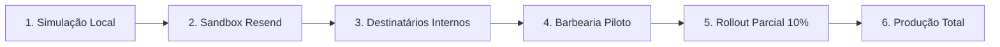

# 📋 Avaliação de Provedores e Modelo de Consentimento — BARBEOS (Etapa 15E)

Este documento estabelece a avaliação técnica e regulatória de canais de notificação, os requisitos de conformidade com a LGPD, o modelo de consentimento e preferências, a comparação de provedores e o plano de rollout piloto seguro para o **BARBEOS**, em conformidade com [docs/NOTIFICATIONS_DESIGN.md](./NOTIFICATIONS_DESIGN.md), [docs/NOTIFICATIONS_OUTBOX_IMPLEMENTATION.md](./NOTIFICATIONS_OUTBOX_IMPLEMENTATION.md) e [docs/NOTIFICATIONS_WORKER_IMPLEMENTATION.md](./NOTIFICATIONS_WORKER_IMPLEMENTATION.md).

> [!IMPORTANT]
> **Documento de Descoberta Técnica e Design Regulatório**  
> - **Nenhum provedor foi conectado.**  
> - **Nenhuma credencial de API foi adicionada ao repositório ou variáveis.**  
> - **Nenhuma mensagem real de e-mail, WhatsApp ou SMS foi enviada.**  
> - **Nenhum dado de teste ou registro fictício foi criado em produção.**  
> - **Nenhuma alteração em regras de agendamento, financeiro ou banco de dados foi aplicada.**

---

## 1. Matriz de Prontidão de Canais (Channel Readiness Matrix)

| Canal | Campo de Contato | Verificado? | Consentimento Existe? | Opt-out / Unsubscribe? | Canal Preferido? | Isolamento Multi-tenant | Templates Prontos? | Credenciais Ausentes? | Telemetria de Fila? | Classificação | Principais Bloqueadores |
|---|---|---|---|---|---|---|---|---|---|---|---|
| **E-mail** | `customers.email` | ❌ Não | ❌ Não | ❌ Não | ❌ Não | ✅ Sim (`barbershop_id`) | ⚠️ Design textual apenas | ✅ Sim | ✅ Sim (`outbox.status`) | **READY AFTER CONSENT WORK** | Modelo de consentimento ausente; e-mails não verificados; falta de link/cabeçalho de descadastro (`List-Unsubscribe`); provedor não conectado. |
| **WhatsApp** | `customers.phone` | ❌ Não | ❌ Não | ❌ Não | ❌ Não | ✅ Sim (`barbershop_id`) | ⚠️ Rascunho informal | ✅ Sim | ✅ Sim (`outbox.status`) | **NOT READY** | Telefone sem normalização E.164 (`+55...`); falta de verificação OTP; ausência de WhatsApp Business Account (WABA) e templates HSM aprovados pela Meta; alto risco de banimento de número caso utilizado gateway não-oficial. |
| **SMS** | `customers.phone` | ❌ Não | ❌ Não | ❌ Não | ❌ Não | ✅ Sim (`barbershop_id`) | ⚠️ Inexistente | ✅ Sim | ✅ Sim (`outbox.status`) | **NOT READY** | Custo unitário desproporcional no Brasil (R$ 0,08–0,15/SMS); ausência de rota de resposta STOP (Anatel); baixa taxa de engajamento comparada ao e-mail/WhatsApp. |

### Diagnósticos Críticos Identificados no Código:
```text
MISSING — communication preference model
```
```text
MISSING — authoritative barbershop timezone
```

---

## 2. Inventário e Segurança de Dados de Contato

1. **Campo Canônico de E-mail:**
   - Na tabela `public.customers`: `customers.email` (`text NULL`).
   - Na tabela `public.profiles`: Não possui coluna de e-mail (gerenciado internamente pelo Supabase Auth em `auth.users.email`).
   - Na tabela `public.barbershops`: `barbershops.contacts->>'email'` (`text NULL`).
2. **Campo Canônico de Telefone:**
   - Na tabela `public.customers`: `customers.phone` (`text NULL`).
   - Na tabela `public.profiles`: `profiles.phone` (`text NULL`).
   - Na tabela `public.barbershops`: `barbershops.contacts->>'phone'` e `contacts->>'whatsapp'`.
3. **Estado de Verificação:**
   - **UNVERIFIED**: Tanto e-mail quanto telefone de clientes na reserva pública são informados em texto livre, sem confirmação prévia por código OTP, token assinado ou double opt-in.
4. **Formato de Normalização Atual:**
   - O telefone é limpo na RPC `create_public_booking` via expressão regular:
     ```sql
     v_clean_phone := regexp_replace(p_customer_phone, '\D', '', 'g');
     ```
   - Gera uma sequência de 10 ou 11 dígitos numéricos (`11999999999`).
   - **Gargalo:** Não possui o código do país DDI (`+55`), impedindo uso direto em APIs internacionais que exigem o padrão canônico internacional **E.164** (`+5511999999999`).
5. **Propriedade e Isolamento de Tenant:**
   - Todos os registros de clientes possuem `barbershop_id NOT NULL` e RLS restrito.
   - O mesmo número de telefone ou e-mail pode ser utilizado pelo mesmo consumidor em barbearias diferentes sem que ocorra vazamento cruzado de histórico ou agendamentos.
6. **Agendamento Anônimo:**
   - Quando um cliente não-autenticado agenda em `/agendar`, a RPC pesquisa por telefone existente dentro daquela barbearia; se não encontrar, cria uma nova linha em `public.customers` com `profile_id = NULL`.
7. **Uso de Contato Sem Consentimento:**
   - Sob a LGPD (Lei nº 13.709/2018), mensagens meramente informativas de execução contratual (ex.: "seu corte está confirmado") podem se fundamentar no Art. 7º, V (execução de contrato).
   - Contudo, **mensagens de lembrete, pesquisa de satisfação, marketing ou envio via WhatsApp** sem opção explícita de escolha ou botão de descadastro configuram prática invasiva e vulnerabilidade jurídica.

---

## 3. Design do Modelo de Consentimento e Preferências

Para sanar o bloqueador `MISSING — communication preference model`, projeta-se a criação da tabela `public.customer_notification_preferences`.

### Especificação Conceitual do Schema

```sql
CREATE TABLE public.customer_notification_preferences (
    id uuid PRIMARY KEY DEFAULT gen_random_uuid(),
    barbershop_id uuid NOT NULL REFERENCES public.barbershops(id) ON DELETE CASCADE,
    customer_id uuid NULL REFERENCES public.customers(id) ON DELETE CASCADE,
    phone text NULL,
    email text NULL,
    channel text NOT NULL CHECK (channel IN ('email', 'whatsapp', 'sms')),
    purpose text NOT NULL CHECK (
        purpose IN (
            'appointment_confirmation',
            'appointment_reminder',
            'appointment_cancellation',
            'appointment_rescheduling',
            'marketing'
        )
    ),
    consent_status text NOT NULL DEFAULT 'unknown' CHECK (
        consent_status IN ('unknown', 'opted_in', 'opted_out')
    ),
    source text NOT NULL, -- 'public_booking_checkbox', 'customer_portal', 'admin_staff', 'unsubscribe_link'
    captured_at timestamptz NOT NULL DEFAULT now(),
    updated_at timestamptz NOT NULL DEFAULT now(),
    revoked_at timestamptz NULL,

    CONSTRAINT customer_notification_pref_unique UNIQUE (barbershop_id, customer_id, channel, purpose)
);
```

### Regras de Governança e Decisão:
1. **Regra Padrão:**
   - Ausência de consentimento (`consent_status = 'unknown'`) **NUNCA** deve ser interpretada como `opted_in`.
2. **Mensagens Transacionais Obrigatórias:**
   - Confirmações de agendamento e cancelamentos emergenciais disparados pela própria barbearia são elegíveis sob base legal de Execução Contratual, desde que mantida opção visível de descadastro de mensagens futuras.
3. **Lembretes e Marketing:**
   - Exigem estritamente `opted_in` explícito através de checkbox voluntário na tela de agendamento (não pré-marcado).
4. **Isolamento de Tenant:**
   - O consentimento dado à Barbearia "X" não se estende à Barbearia "Y". O escopo é estritamente `barbershop_id`.
5. **Auditoria de Equipe:**
   - Funcionários e recepcionistas não podem alterar o consentimento de um cliente para `opted_in` sem base auditável (ex.: termo impresso assinado ou solicitação expressa).

---

## 4. Comparativo de Provedores Relevantes

| Critério | **Resend (Recomendado Primeiro)** | **Meta WhatsApp Cloud API Oficial** | **Z-API / Evolution (Não Oficial)** | **Twilio / Zenvia (SMS)** |
|---|---|---|---|---|
| **Canal** | E-mail | WhatsApp | WhatsApp | SMS |
| **Compatibilidade de Runtime** | Perfeita (Node.js, Nitro, TypeScript SDK nativo) | Boa (REST API via HTTP) | Mediana (Instância Docker separada) | Boa (Node.js SDK) |
| **Complexidade de Integração** | **Muito Baixa** (Chave de API + SDK oficial) | **Alta** (Meta Business Manager + WABA) | **Alta** (QRCodes, quedas de sessão) | Baixa / Média |
| **Ambiente de Testes / Sandbox** | **Excelente** (Domínio `onboarding@resend.dev` gratuito) | Complexo (Números de teste Meta limitados) | Inexistente (Usa número real) | Excelente (Twilio Magic Numbers) |
| **Templates e Conteúdo** | Templates em código (React Email / HTML simples) | Rígido (Aprovação prévia de HSM pela Meta) | Livre (Texto puro) | Livre (160 caracteres) |
| **Webhooks de Status** | Nativos com assinatura criptográfica Svix | Nativos via Meta Webhooks | Webhooks customizados locais | Nativos com validação HMAC |
| **Mecanismo de Opt-out** | Suporte nativo a headers `List-Unsubscribe` | Requer resposta de texto "SAIR" / bot | Requer lógica manual no bot | Requer resposta "STOP" |
| **Risco de Banimento / Bloqueio** | Zero (Configuração DKIM/SPF) | Zero (Desde que siga políticas de HSM) | **CRÍTICO** (Alto risco de ban de chip) | Zero |
| **Custo Operacional** | Baixo (~3.000 e-mails/mês gratuitos; planos previsíveis) | 1.000 conversas de serviço grátis/mês; tarifado por conversa | Mensalidade fixa por chip + risco operacional | Alto (R$ 0,08–0,15 por SMS enviado) |
| **Isolamento de Tenants** | Suporte a tags (`barbershop_id`, `event_id`) | Requer multi-WABA ou tag no payload | Monolítico ou multi-instância frágil | Suporta subcontas |

### Recomendações Estratégicas:
1. **Primeiro Canal de Piloto:** **E-mail** (via **Resend**).
   - *Justificativa:* Menor complexidade operacional, zero risco de banimento de número, conformidade simplificada com a LGPD via headers de descadastro e disponibilidade de sandbox imediato sem requisição de chips corporativos.
2. **Canal Postergado:** **WhatsApp**.
   - *Justificativa:* Deve ser implementado exclusivamente através da API Oficial da Meta (Cloud API), exigindo previamente conta empresarial verificada (WABA) e aprovação formal dos templates de utilidade (HSM).

---

## 5. Design dos Templates de Mensagem (Português Brasileiro)

Os templates foram desenhados para garantir brevidade, cortesia, minimização absoluta de dados pessoais e links seguros sem parâmetros sensíveis na URL.

### 1. Confirmação de Agendamento (`appointment.created`)
- **Assunto:** `Agendamento Confirmado — {{barbershop_name}}`
- **Corpo (Texto Limpo):**
  ```text
  Olá, {{customer_first_name}}!

  Seu horário foi agendado com sucesso na {{barbershop_name}}.

  📅 Data: {{scheduled_date}}
  ⏰ Horário: {{scheduled_time}}
  ✂️ Serviço: {{service_names}}
  💈 Profissional: {{professional_name}}

  Para visualizar seu agendamento ou consultar o endereço da barbearia:
  {{safe_appointment_url}}

  Caso precise alterar ou cancelar, faça-o com pelo menos 2 horas de antecedência.
  {{barbershop_name}} • Contato: {{barbershop_phone}}

  Para não receber mais comunicados desta barbearia: {{safe_unsubscribe_url}}
  ```

### 2. Lembrete de Horário (`appointment.reminder_due`)
- **Assunto:** `Lembrete do seu horário hoje — {{barbershop_name}}`
- **Corpo (Texto Limpo):**
  ```text
  Olá, {{customer_first_name}}!

  Passando para lembrar do seu atendimento hoje na {{barbershop_name}}:

  ⏰ Horário: {{scheduled_time}}
  ✂️ Serviço: {{service_names}} com {{professional_name}}

  Local: {{barbershop_address}}
  Acompanhe em: {{safe_appointment_url}}

  Até logo!
  ```

### 3. Cancelamento de Agendamento (`appointment.cancelled`)
- **Assunto:** `Agendamento Cancelado — {{barbershop_name}}`
- **Corpo (Texto Limpo):**
  ```text
  Olá, {{customer_first_name}}!

  Confirmamos o cancelamento do seu horário marcado para {{scheduled_date}} às {{scheduled_time}} na {{barbershop_name}}.

  Caso deseje escolher uma nova data em outro momento, visite:
  {{safe_booking_url}}

  {{barbershop_name}}
  ```

### 4. Remarcação de Agendamento (`appointment.rescheduled`)
- **Assunto:** `Agendamento Remarcado — {{barbershop_name}}`
- **Corpo (Texto Limpo):**
  ```text
  Olá, {{customer_first_name}}!

  Seu agendamento na {{barbershop_name}} foi remarcado com sucesso:

  📅 Novo Horário: {{new_scheduled_date}} às {{new_scheduled_time}}
  ✂️ Serviço: {{service_names}}
  💈 Profissional: {{professional_name}}

  Consulte os detalhes em: {{safe_appointment_url}}
  ```

---

## 6. Fuso Horário Autoritativo e Regras de Lembretes

### Situação Atual:
```text
MISSING — authoritative barbershop timezone
```
- Atualmente, as RPCs realizam um fallback implícito: `COALESCE(v_barbershop.settings->>'timezone', 'America/Sao_Paulo')`.
- Não existe uma coluna `timezone` dedicada na tabela `barbershops`, nem campo visual de configuração no painel administrativo (`/admin/configuracoes`).

### Política Recomendada:
1. **Coluna Formal:** Criar coluna `timezone text NOT NULL DEFAULT 'America/Sao_Paulo'` na tabela `barbershops` com validação de fusos IANA válidos (`America/Sao_Paulo`, `America/Manaus`, `America/Cuiaba`, `America/Belem`, `America/Fortaleza`, etc.).
2. **Horário Silencioso (Quiet Hours):**
   - **Regra Estrita:** Nenhuma mensagem automática de lembrete pode ser despachada entre **22:00** e **08:00** no fuso horário da barbearia.
   - **Ajuste:** Caso um lembrete de 24h caia no período silencioso, o envio é antecipado para as 20:00 da véspera ou adiado para as 08:00 da manhã do dia.
3. **Agendamento Próximo ao Atendimento:**
   - Agendado com menos de 24h: O lembrete de 24h é ignorado (`skipped_due_to_window`).
   - Agendado com menos de 2h: Ambos os lembretes são cancelados; apenas a confirmação imediata é enviada.

---

## 7. Plano de Gestão de Credenciais e Segredos

1. **Armazenamento:**
   - Todas as chaves de API (`RESEND_API_KEY`, `RESEND_WEBHOOK_SECRET`) devem residir exclusivamente nas variáveis de ambiente encriptadas da **Vercel** (Environment Variables: *Production*, *Preview* e *Development*).
2. **Segregação de Ambientes:**
   - Chaves de sandbox para branches de homologação e pré-visualização;
   - Chave restrita com permissão de envio apenas para produção.
3. **Proibições Inegociáveis:**
   - **Proibido** qualquer prefixo `VITE_` em chaves de provedores de notificação (evita vazamento para o bundle estático do navegador).
   - **Proibido** commit de arquivos `.env` ou chaves em texto plano no Git.
   - **Proibido** incluir segredos em payloads de observabilidade ou logs de servidor.

---

## 8. Plano de Rollout Piloto com Rollback Imediato

O rollout deve seguir estritamente as seguintes etapas progressivas:



### Critérios por Etapa:
1. **Fase 1 — Simulação Local (Concluída):** Execução do outbox worker via `SimulatedNotificationProvider`. 0 mensagens reais.
2. **Fase 2 — Sandbox:** Envio exclusivo para contas internas da equipe BARBEOS utilizando o domínio de testes do provedor.
3. **Fase 3 — Destinatários Internos:** Validação visual de renderização de e-mails em clientes reais (Gmail, Outlook, Apple Mail, mobile).
4. **Fase 4 — Barbearia Piloto:** Uma única barbearia voluntária com consentimento formal do proprietário.
5. **Fase 5 — 10% dos Clientes Elegíveis:** Envio ativado apenas para clientes com `consent_status = 'opted_in'`.
6. **Kill Switch & Rollback:**
   - Caso a taxa de bounce exceda 2% ou ocorram reclamações de spam:
   - Acionamento imediato da flag `ENABLE_NOTIFICATION_DISPATCHER = false` no servidor, revertendo instantaneamente o despachante para o modo no-op sem impactar o fluxo de agendamento.

---

## 9. Controles de Segurança, Privacidade e Operações

1. **Validação Criptográfica de Webhooks:** Assinaturas de webhooks de entrega devem ser verificadas obrigatoriamente via HMAC-SHA256 (ex.: padrão Svix).
2. **Minimização de PII:** Corpos de e-mail e dados de contato jamais devem ser armazenados na tabela `notification_outbox` ou nos metadados de auditoria.
3. **Limitação de Taxa (Rate Limiting):** O worker processa lotes estritamente limitados entre 1 e 25 eventos com intervalo controlado.
4. **Prevenção de Abuso:** Proteção contra disparos massivos via RPC atômica e advisory locks.
5. **Desconexão do Core de Reservas:** A indisponibilidade de qualquer serviço de e-mail ou WhatsApp **jamais** poderá interromper ou reverter uma reserva de horário feita pelo cliente.

---

## 10. Questões Abertas de Produto e Jurídico

1. **Base Legal para Confirmação Imediata:** O comitê jurídico deve formalizar se a confirmação imediata da reserva pode ser enquadrada como execução de contrato (dispensando checkbox de opt-in prévio).
2. **Política de Lembrete:** Definir se lembretes por e-mail exigirão opt-in explícito no agendamento ou se constarão nas preferências da conta.
3. **Aquisição de Linha WhatsApp Oficial:** Avaliar viabilidade de WABA única compartilhada multi-tenant vs. conexão de números individuais por barbearia.

---

## 11. Declaração Formal de Conformidade (Status Explicito)

```text
No provider connected.
No credentials added.
No messages sent.
No production notification data created.
```

- **Nenhum provedor externo foi conectado.**
- **Nenhuma credencial de API foi adicionada ao projeto.**
- **Nenhuma mensagem real foi enviada.**
- **Nenhum registro de notificação foi inserido em produção.**
- **A aplicação e o banco permanecem 100% seguros e isolados.**

