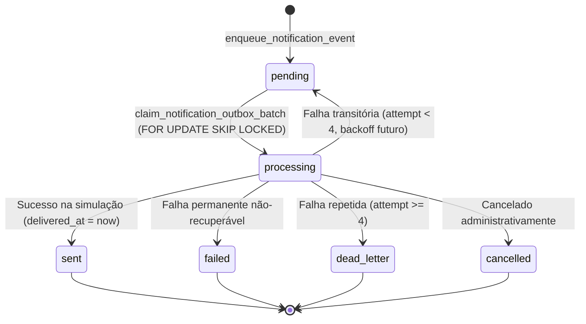

# ⚙️ Implementação do Worker de Notificações Simulado (Etapa 15C) — BARBEOS

Este documento detalha a implementação técnica do Worker de Despacho de Notificações em modo seguro e simulado para o **BARBEOS**, em conformidade com as diretrizes de [docs/NOTIFICATIONS_DESIGN.md](./NOTIFICATIONS_DESIGN.md) e [docs/NOTIFICATIONS_OUTBOX_IMPLEMENTATION.md](./NOTIFICATIONS_OUTBOX_IMPLEMENTATION.md).

---

## 1. Localização do Worker e Modelo de Execução

- **Localização no Código:** [`src/services/notification-worker.service.ts`](file:///c:/Users/hugoh/OneDrive/Área%20de%20Trabalho/APP%20BARBEARIA/src/services/notification-worker.service.ts)
- **Funções de Banco de Dados:** [`supabase/migrations/20260909190000_add_notification_worker_claim.sql`](file:///c:/Users/hugoh/OneDrive/Área%20de%20Trabalho/APP%20BARBEARIA/supabase/migrations/20260909190000_add_notification_worker_claim.sql)
- **Fronteira Exclusiva de Servidor:**
  - O serviço possui verificação estrita (`assertServerEnvironment`) que impede execução acidental a partir de bundles do navegador.
  - As funções de claim e conclusão possuem execução revogada para `PUBLIC`, `anon` e `authenticated`, sendo invocáveis exclusivamente pelo backend/serviço autenticado com credenciais de serviço (`service_role`).

---

## 2. Estratégia de Concorrência e Claim Atômico

A função `public.claim_notification_outbox_batch(p_batch_size, p_barbershop_id)` realiza o claim de eventos elegíveis através de uma Common Table Expression (CTE) com travamento atômico:

```sql
WITH eligible AS (
    SELECT outbox.id
    FROM public.notification_outbox outbox
    WHERE outbox.status = 'pending'
      AND outbox.scheduled_for <= now()
      AND (p_barbershop_id IS NULL OR outbox.barbershop_id = p_barbershop_id)
    ORDER BY outbox.scheduled_for ASC
    LIMIT v_actual_limit
    FOR UPDATE SKIP LOCKED
),
claimed AS (
    UPDATE public.notification_outbox outbox
    SET status = 'processing',
        attempt_count = outbox.attempt_count + 1,
        last_attempt_at = now(),
        updated_at = now()
    FROM eligible
    WHERE outbox.id = eligible.id
    RETURNING ...
)
SELECT * FROM claimed;
```

### Garantias do Claim:

1. **`FOR UPDATE SKIP LOCKED`:** Impede que dois workers concorrentes processem o mesmo evento, eliminando risco de envios duplicados.
2. **Incremento Atômico:** `attempt_count` é incrementado exatamente uma vez por claim.
3. **Transição Imediata:** Linhas elegíveis passam instantaneamente de `'pending'` para `'processing'`.
4. **Exclusão de Estados Finais:** Registros com status `'sent'`, `'cancelled'`, `'failed'` ou `'dead_letter'` são sumariamente ignorados.

---

## 3. Limite Estrito de Lotes (Batch Bounding)

- **Faixa Permitida:** Entre `1` e `25` eventos por execução.
- **Validação no Banco:** `LEAST(GREATEST(COALESCE(p_batch_size, 10), 1), 25)`.
- **Validação no Serviço:** Requisições acima de 25 disparam erro `WORKER_BATCH_LIMIT_EXCEEDED` para prevenir contenção de recursos.

---

## 4. Máquina de Estados e Transições Controladas

O ciclo de vida na outbox é gerenciado via `public.complete_notification_outbox_event(p_event_id, p_status, ...)` e restrito a linhas no estado `'processing'`:



---

## 5. Provedor Simulado (`SimulatedNotificationProvider`)

Implementado em [`src/services/notification-provider.ts`](file:///c:/Users/hugoh/OneDrive/Área%20de%20Trabalho/APP%20BARBEARIA/src/services/notification-provider.ts):

- **Isolamento Total:** Zero chamadas de rede ou SDKs externos.
- **Determinismo:** Suporta modos configuráveis para ensaio (`success`, `retryable_failure`, `permanent_failure`).
- **IDs Sintéticos:** Gera identificadores não-reais (ex.: `sim_msg_a1b2c3d4_k8...`).
- **Produção:** Em tempo de execução real, o provedor ativo permanece `DisabledNotificationProvider`, garantindo que nenhuma mensagem seja disparada em produção.

---

## 6. Política de Retentativas com Backoff Deliberado

Para falhas marcadas como transitórias (`retryable: true`):

- **Tentativa 1:** Reagenda para `agora + 1 minuto`.
- **Tentativa 2:** Reagenda para `agora + 5 minutos`.
- **Tentativa 3:** Reagenda para `agora + 15 minutos`.
- **Tentativa 4 ou superior (`attempt_count >= 4`):** Transição automática para `dead_letter` com motivo `EXCEEDED_MAX_ATTEMPTS`.

---

## 7. Política de Dead-Letter (DLQ)

Eventos que esgotam o teto de 4 tentativas são migrados para `status = 'dead_letter'`:

- Registram `failed_at = now()`.
- Registram `failure_code` operacional sanitizado.
- Jamais são reprocessados automaticamente pela fila de `pending`.
- Ficam disponíveis para auditoria ou intervenção do suporte.

---

## 8. Isolamento Multi-Tenant

- O worker aceita o parâmetro opcional `barbershopId`.
- Quando informado, o claim filtra estritamente `outbox.barbershop_id = p_barbershop_id`.
- Impede que um estabelecimento visualize ou processe a fila de outro.

---

## 9. Observabilidade Segura e Zero PII

O worker emite exclusivamente telemetria operacional não-identificável:

- `notification_worker_started`
- `notification_event_claimed`
- `notification_event_simulated`
- `notification_event_retry_scheduled`
- `notification_event_dead_lettered`
- `notification_worker_completed`

### Resumo Operacional Agregado:

A resposta do worker retorna exclusivamente contadores agregados:

```json
{
  "claimed": 2,
  "sent": 2,
  "retried": 0,
  "failed": 0,
  "dead_lettered": 0,
  "duration_ms": 42
}
```

_Zero campos de nome, telefone, e-mail, notas ou corpo de mensagem._

---

## 10. Declaração Formal de Conformidade

- **Nenhuma mensagem real de WhatsApp, e-mail ou SMS foi disparada.**
- **Nenhum registro de notificação foi inserido em produção.**
- **Nenhum provedor externo ou credencial de API foi conectado.**
