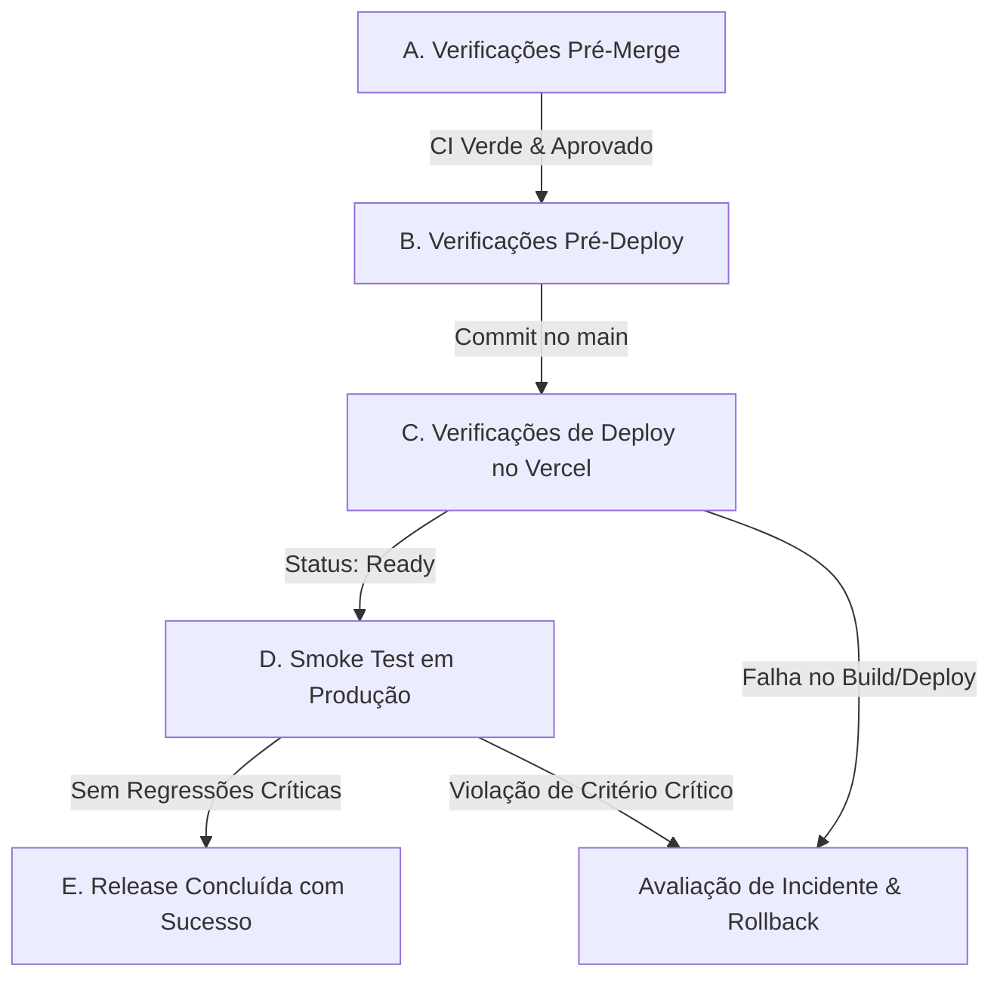

# 🚀 Runbook de Release & Prontidão para Produção — BARBEOS

Este documento estabelece o processo padronizado, seguro e reprodutível de lançamento e validação de versões para o **BARBEOS**. Todos os deploys em produção devem seguir rigorosamente as etapas descritas neste runbook.

---

## 📌 Visão Geral do Fluxo de Release



---

## A. Verificações Pré-Merge (Pre-Merge Checks)

Antes de realizar merge de qualquer Pull Request ou finalizar a branch de release para `main`, certifique-se de validar os 11 pontos a seguir:

1. **Working Tree Limpo:**
   Verifique se não existem alterações locais pendentes ou arquivos não rastreados acidentais:
   ```bash
   git status
   ```
   A saída deve indicar `nothing to commit, working tree clean`.

2. **Branch Correta:**
   Confirme se você está trabalhando na branch correta de feature/fix antes de apontar para `main`:
   ```bash
   git branch --show-current
   ```

3. **Sincronização com a `main` Mais Recente:**
   Faça pull das alterações mais recentes da branch principal remota:
   ```bash
   git pull origin main
   ```

4. **Revisão Minuciosa dos Arquivos Alterados:**
   Inspecione as diferenças para assegurar que apenas arquivos dentro do escopo da tarefa foram modificados:
   ```bash
   git diff --stat origin/main...HEAD
   ```

5. **Garantia de Não Exposição de Segredos / `.env`:**
   - Assegure-se de que arquivos `.env`, chaves privadas, tokens JWT ou senhas **não** estejam no stage do Git (`git status`).
   - Verifique se `.gitignore` protege todos os arquivos de segredos locais.

6. **Bloqueio de Migrações ou Alterações de RLS Não Autorizadas:**
   - Nenhuma alteração de schema em `supabase/migrations/` ou políticas de RLS deve ser incluída a menos que faça parte de um RFC aprovado e validado separadamente.

7. **Execução Obrigatória da Suíte de Qualidade Local:**
   Execute a sequência completa de validação:
   ```bash
   npm ci
   npm run lint
   npm run lint:icons
   npm run build
   npm test
   npm run test:e2e
   ```
   *Nota: Todos os comandos devem finalizar com código de saída 0.*

8. **Revisão do Status do CI no GitHub:**
   - Acesse a aba **Actions** no repositório GitHub (`https://github.com/Hugobleme/BARBEOS/actions`).
   - Confirme que o workflow `CI` finalizou com status verde (sucesso) para o commit/PR.

9. **Mensagem de Commit e Escopo da Release:**
   - O commit deve seguir a convenção de Commits Convencionais (ex.: `fix(booking): ...`, `feat(pdv): ...`, `perf(a11y): ...`).
   - O escopo deve refletir fielmente as alterações efetuadas.

10. **Varredura Estática e Escaneamento de Segredos:**
    - Verifique se o scanner de segredos do GitHub (Secret Scanning / Dependabot) não aponta alertas abertos.

11. **Isolamento Estrito de Testes E2E com Escrita:**
    - Testes destrutivos ou com mutação no banco de dados (`E2E_WRITABLE_ENV=true`) devem rodar **apenas** em ambiente de teste isolado ou mock.
    - É terminantemente proibido rodar testes com escrita contra instâncias de produção.

---

## B. Verificações Pré-Deploy (Pre-Deploy Checks)

Antes de autorizar ou acompanhar o deployment em produção:

1. **Confirmação do Commit no GitHub `main`:**
   Verifique que o commit a ser implantado está mesclado na branch `main` oficial do repositório remoto.
2. **Confirmação do Status do GitHub Actions:**
   O workflow de CI para o commit específico na branch `main` deve estar com status **Success** (verde).
3. **Identificação do Hash do Commit:**
   Obtenha o hash do commit exato que está sendo implantado:
   ```bash
   git rev-parse --short HEAD
   # Exemplo: 4ba8cb3
   ```
4. **Confirmação do Projeto e Branch de Produção na Vercel:**
   No painel da Vercel, certifique-se de que o projeto ativo é o `BARBEOS` e a **Production Branch** está configurada exclusivamente como `main`.
5. **Checagem de Ausência de Incidentes Ativos:**
   Verifique se não há nenhum incidente em andamento (P0/P1) ou solicitação de rollback ativa antes de iniciar o deploy.
6. **Confirmação de Variáveis de Ambiente no Painel Vercel:**
   - Verifique que as variáveis de ambiente necessárias (`VITE_SUPABASE_URL`, `VITE_SUPABASE_ANON_KEY`) estão devidamente cadastradas no ambiente **Production**.
   - **Regra de Ouro:** Nunca imprima, copie ou exponha valores dessas chaves em logs, tickets ou canais de comunicação.
7. **Validação de Migrações Dependentes:**
   - Caso a versão dependa de migrações no banco de dados, certifique-se de que a migração foi aplicada previamente e aprovada pelos mantenedores do banco.

---

## C. Verificações de Deploy no Painel Vercel (Deploy Checks)

O deployment é gerenciado automaticamente pela integração GitHub-Vercel ao receber commits na branch `main`. Acompanhe as seguintes etapas no dashboard da Vercel:

1. **Localizar o Deployment pelo Hash Git:**
   - Acesse o painel do projeto na Vercel > aba **Deployments**.
   - Localize o deployment cujo resumo mencione o hash do commit obtido na seção B.3.

2. **Confirmar o Status do Deployment:**
   - O status deve transicionar para:
     ```text
     Ready
     ```
   - Tempo médio de build: ~1 a 3 minutos.

3. **Procedimento em Caso de Falha no Build/Deploy:**
   - Se o status for `Error` ou `Failed`:
     - Inspecione os **Build Logs** na Vercel para identificar a causa raiz (ex.: erro de tipagem TypeScript, arquivo ausente, estouro de bundle).
     - **Não tente forçar redeploys cegamente.**
     - Abra o checklist de resposta a incidentes ([INCIDENT_RESPONSE.md](./INCIDENT_RESPONSE.md)).
     - A Vercel mantém o deployment anterior ativo caso o novo build falhe, portanto o tráfego de produção não é interrompido imediatamente. Determine se a branch `main` requer hotfix ou reversão de commit.

4. **Confirmar Domínio de Produção Anexado:**
   - Verifique se os domínios oficiais de produção (ex.: domínio customizado ou `*.vercel.app`) apontam para o novo deployment que está em estado `Ready`.

5. **Confirmar Origem da Branch `main`:**
   - Certifique-se de que o deployment promovido à produção foi construído a partir de `main` e não de um preview ou branch de rascunho.

---

## D. Testes de Smoke Pós-Deploy (Post-Deploy Smoke Test)

Assim que o deployment estiver em estado `Ready` e associado ao domínio de produção, execute imediatamente o roteiro não-destrutivo de smoke test:

👉 **Acesse o roteiro completo:** [docs/PRODUCTION_SMOKE_TEST.md](./PRODUCTION_SMOKE_TEST.md)

O teste de smoke deve ser executado em janela anônima, sem alterar registros de clientes, sem criar agendamentos reais e sem expor dados confidenciais.

---

## E. Critérios de Decisão de Rollback (Rollback Decision Criteria)

A estabilidade e a segurança do BARBEOS têm prioridade máxima. Use os critérios abaixo para decidir entre **Rollback Imediato** e **Monitoramento com Hotfix**.

### 🛑 Condições que Exigem Avaliação / Execução Imediata de Rollback:

Se qualquer um dos seguintes sintomas for detectado durante o smoke test ou nos primeiros minutos após a release:

1. **Home page indisponível** (código 5xx persistente ou tela em branco na rota `/`).
2. **Login inoperante** (falha na renderização ou bloqueio de autenticação na rota `/login`).
3. **ErrorBoundary global disparado em rotas críticas** (exibição de *"Ops, algo não saiu como o esperado"* em agendamento, admin ou diretório).
4. **Agendamento público não inicializa** (clientes não conseguem carregar serviços ou profissionais).
5. **Agendamento público falha ao confirmar** (erro fatal de RPC ou mutação não tratada).
6. **Violação de concorrência atômica** (criação de agendamentos duplicados ou sobreposição de horários no mesmo barbeiro).
7. **Painel Admin inacessível** (administradores não conseguem visualizar a agenda ou carregar módulos).
8. **Módulo de PDV / Caixa inoperante** (erro de componente, falha ao carregar estado do caixa ou tela quebrada).
9. **Aumento abrupto de erros HTTP 401, 403 ou 500** nos endpoints ou consultas Supabase.
10. **Regressão de segurança ou vazamento de dados** (exposição de dados entre barbearias/tenants, chaves de API ou PII de clientes no DOM/logs).
11. **Risco de corrupção financeira** (falhas em carteira, pontos de fidelidade, comissões ou sangrias de caixa).

### 🟡 Condições Não-Críticas (Permitem Monitoramento sem Rollback Imediato):

Sintomas que não bloqueiam a operação e podem ser corrigidos via Pull Request padrão (hotfix planejado):

1. **Desalinhamento visual menor** (margens, espaçamentos ou quebra sutil de texto sem cobrir botões de ação).
2. **Gráfico secundário ou métrica auxiliar de relatório** que não impede a operação diária.
3. **Comportamento do prompt opcional de instalação do PWA** (caso não bloqueie a navegação do usuário).
4. **Pequena variação de performance** que não degrade severamente a usabilidade nem cause time-outs.

### 🛡️ Procedimento Seguro de Rollback:

> [!IMPORTANT]
> **O rollback nunca deve ser executado via comandos destrutivos ou forçados no terminal.**
> O rollback deve seguir o fluxo seguro através da Vercel e ser formalmente comunicado ao responsável pelo sistema:
>
> 1. Acesse o **Vercel Dashboard > BARBEOS > Deployments**.
> 2. Localize o deployment anterior estável que estava em produção antes do lançamento.
> 3. Clique nos três pontos (`...`) do deployment estável anterior e selecione **"Instant Rollback"** (ou **"Promote to Production"**).
> 4. Confirme a operação. O tráfego de produção será direcionado instantaneamente para a versão anterior comprovadamente sadia.
> 5. Crie um revert no Git (`git revert <hash>`) na branch `main` para manter o repositório sincronizado com o que está em execução.
> 6. Registre o incidente conforme o [INCIDENT_RESPONSE.md](./INCIDENT_RESPONSE.md).
